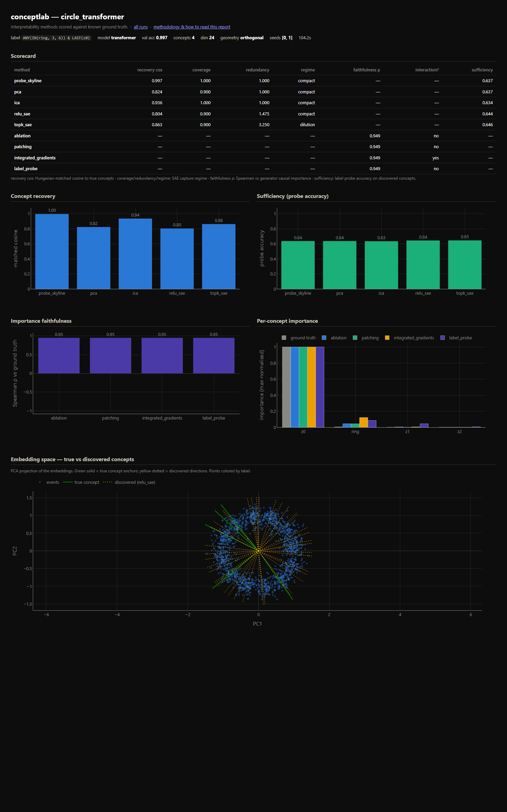

# conceptlab

A ground-truth benchmark for **validating and comparing transformer interpretability methods**.

🌐 **[Methodology & live reports](https://juliarozanova.github.io/conceptlab/)** — the full write-up, plus:
- **[The wiki](https://juliarozanova.github.io/conceptlab/wiki/index.html)** — a guided, stats-from-scratch tour of the data generation method, the 86-concept catalog (boxed cards with correlation bands and legit pathways), and how to make interpretability deductions. Start here if you're new.
- **[Blob reports](https://juliarozanova.github.io/conceptlab/runs/index.html)** — concept *discovery* (SAEs, PCA/ICA, probes) vs planted embedding geometry.
- **[Concept-attribution reports](https://juliarozanova.github.io/conceptlab/concept_runs/index.html)** — compositional *explanation* methods (ICS, TCAV, CAV-ablation, probe-patch) on tabular event sequences, `tabular-concepts` branch.
- **[Fraud transfer](https://juliarozanova.github.io/conceptlab/fraud_runs/fraud_default/report.html)** — the same methods on a TabTransformer trained on synthetic fraud ([fraudgen](https://github.com/juliarozanova/fraudgen)).

Real-model interpretability has no ground truth — "did the SAE find the *real* features?" is unanswerable. `conceptlab` sidesteps this by generating synthetic data where the concepts, their geometry, and their causal importance for the label are **known by construction**. Interpretability methods are then scored on how well they

1. **recover** the planted concepts from a trained model's activations, and
2. **attribute label importance** to those concepts correctly.

Because the data is synthetic, we also get **causal ground-truth importance** for free — by intervening in the data generator (flip a concept, regenerate, measure the change in the model's output) rather than approximating it with a method under test.

## Design

Three cleanly separated layers so any method can be compared on any dataset/model:

```
GROUND TRUTH (known)          MODEL (trained)              METHODS (under test)
concept anchors, geometry --> toy model learns          --> each method sees only
label function f(concepts)    label from embeddings         (model, data), outputs:
causal importance             activations recorded          - discovered concepts
                                                            - importance scores
                                        EVAL: score method output against ground truth
```

## Quickstart

```bash
uv sync                                             # create env (CPU torch)
uv run conceptlab-run --config configs/easy_blobs.yaml
uv run conceptlab-run --config configs/superposition_xor.yaml
uv run conceptlab-run --config configs/circle_transformer.yaml
open docs/runs/index.html                           # cross-run comparison
```

**Pre-generated reports** are live on GitHub Pages:
- **[Cross-run index](https://juliarozanova.github.io/conceptlab/runs/index.html)** — headlines from all runs
- **[easy_blobs](https://juliarozanova.github.io/conceptlab/runs/easy_blobs/report.html)** — harness sanity check
- **[superposition_xor](https://juliarozanova.github.io/conceptlab/runs/superposition_xor/report.html)** — SAEs beat PCA; linear importance fails on XOR
- **[circle_transformer](https://juliarozanova.github.io/conceptlab/runs/circle_transformer/report.html)** — SAE dilution on circular concepts

Each run generates data, trains a toy model, runs every configured interpretability
method, evaluates against ground truth, and writes a self-contained `report.html`.

## What's inside

- `conceptlab/datagen.py` — `ConceptSpec`, geometry (point blobs, circular manifolds, correlated pairs, superposition), a small label DSL (AND/OR/XOR/majority/threshold), and generator-level causal importance.
- `conceptlab/models.py` — `ToyMLP` and `ToyTransformer`, both exposing `run_with_cache`.
- `conceptlab/methods/` — linear probe (skyline), PCA/ICA, ReLU & TopK SAEs, integrated gradients, direction ablation & activation patching, behind one `InterpMethod` interface.
- `conceptlab/eval.py` — Hungarian-matched concept recovery, coverage/redundancy (shattering vs. compact vs. dilution regimes), importance faithfulness, sufficiency.
- `conceptlab/report.py` — Plotly HTML reports.

## Starter experiments (they double as harness self-tests)



*Above: the `circle_transformer` report. In the embedding-space panel the eight
ring-position blobs form a circle; the true concept is two axes (green) while the
SAE's discovered directions (yellow) fan out around the whole ring — the
**dilution regime** made visible.*

Blob noise is set so the Gaussians genuinely overlap — no score saturates at 1.0,
so method differences are always visible.

| Config | What it checks | Result |
|---|---|---|
| `easy_blobs` | Harness sanity: probe skyline should ace recovery; causal importance should isolate the label's concepts. | skyline **0.996**, ICA **0.999**, SAEs 0.85 (compact), PCA 0.68; causal methods isolate z0,z1 ✓ |
| `superposition_xor` | 32 concepts in 24 dims with **sparse** background firing. Overcomplete SAEs should beat the dimension-capped linear methods; linear importance should fail on XOR. | TopK SAE recovery **0.92** ≫ PCA **0.41** (ICA 0.94 but coverage-capped at D); faithfulness: causal **0.82–0.85** vs linear label-probe **0.05** ✓ |
| `circle_transformer` | Reproduces the SAE **dilution regime** on a circular concept (12-position ring). | TopK: regime **dilution** (redundancy 3.25, ring-coverage 0.63) vs ReLU+L1 compact (0.375) vs linear baselines 0.25 ✓ |

Two discriminating results:
- The linear label-probe's near-zero faithfulness (**0.05**) on the XOR label — while
  ablation, patching and integrated gradients all score 0.8+ — separates methods that
  capture concept *interactions* from those that only see linear importance.
- The two SAE variants land in **different capture regimes on the same ring**
  (TopK dilutes; ReLU+L1 stays compact): the regime you observe is partly a property
  of the sparsity mechanism, not just of the model under study.

## Adding your own method

Subclass `InterpMethod` (see `conceptlab/methods/base.py`), set `can_discover`
and/or `can_score`, implement `discovered_concepts()` / `score_directions()`, and
register it in `conceptlab/methods/__init__.py`. Everything operates in the input
embedding space R^D, so a discovery method returns `(m, D)` unit directions and a
scoring method takes/returns per-direction importances. The integrated-gradients
implementation is the natural starting point for an "integrated conceptual
sensitivity" variant — swap the integration path or the target scalar.

See `plan.md` for the full design rationale.
